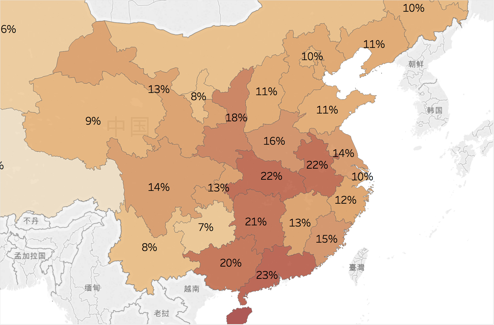

# 2018高考数据可视化

本Project通过结合2000年人口普查数据、2018年高考报名、招生数据，对各省的一本招生率、高考参加率、以及男女出生人口的不均状况，进行可视化。

## 各省出生人数（据2000年出生人口）
### 广东、山东、河南、四川  （2000年出生人口最多的省份）

## 各省光棍绝对人数（据2000年出生人口中的男女人数差）
### 广东、河南 （光棍人数最多的省份)  >10万

## 各省光棍占比（据2000年出生人口: ([男]-[女])/[男] ）
### 海南、两广、两湖、安徽 [光棍率>20%] (堕胎率最高、重男轻女观念最重的省)

## 未参加高考人数占同龄人比例（据2018年高考报名数据，及2000年出生人口数据）
### 云南：最低比例参加高考，39%同龄人参考高考
### 陕西：最高比例参加高考，91%同龄人参加高考

## 一本招生占人口比（根据2018年一本招生计划，以及2000年出生人口数据）
### 北京、天津：一本招生占人口比最高(26%)
### 云南、江西：一本招生占人口比最低(3%, 5%)

