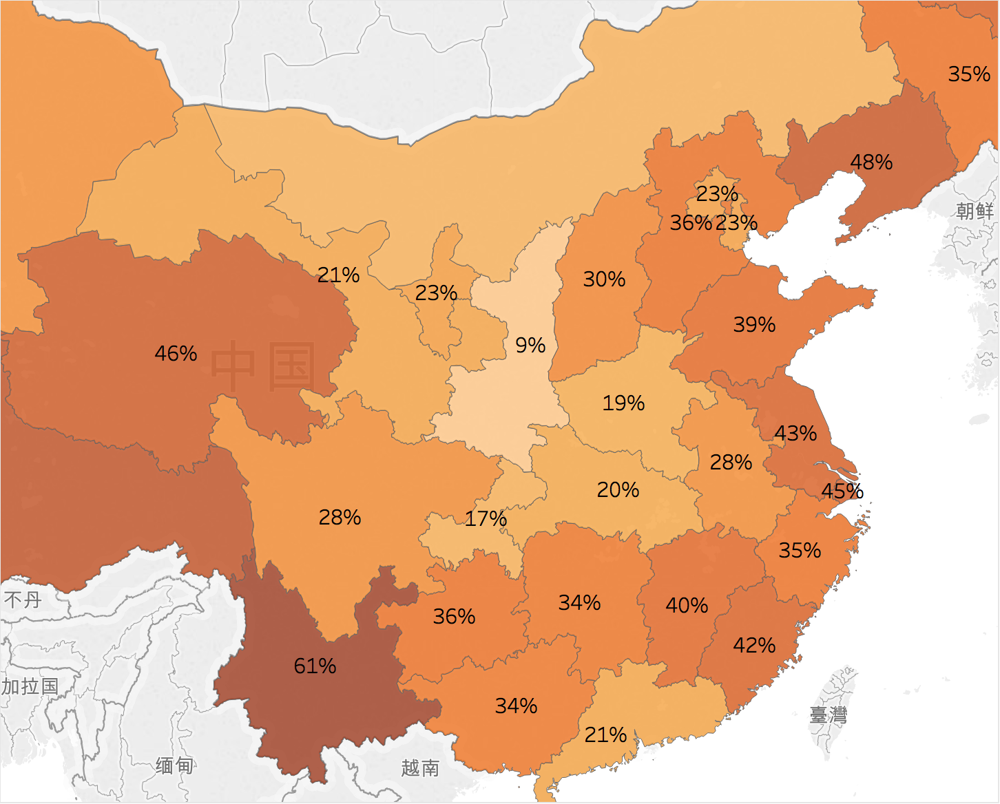

# 2018高考数据可视化

本Project通过结合2000年人口普查数据、2018年高考报名、招生数据，对各省的一本招生率、高考参加率、以及男女出生人口的不均状况，进行可视化。

## 各省光棍的绝对人数（根据2000年出生人口中的男女人数差）

## 各省光棍占比（根据2000年出生人口）

## 未参加高考人数占同龄人比例（根据2018年高考报名数据，以及2000年出生人口数据）

## 一本招生占人口比（根据2018年一本招生计划，以及2000年出生人口数据）

